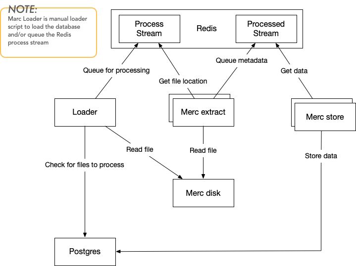

# README

Merc is something I made to process the PE Malware ML Learning Dataset from [Michael Lester at Practical Security Analytics](https://practicalsecurityanalytics.com/pe-malware-machine-learning-dataset/). Thanks to [Blake's R&D](https://bmcder.com/) for introducing me to the data and his work on using it [Machine Learning dataset](https://bmcder.com/blog/how-would-you-analyse-200000-executables). 

The aim this repo is a demonstration to process the binaries and extract PE data (imports, exports, sections etc.), metadata (magic, entroy, hashes etc.), and strings (static stings) as fast as possible.  

This implementation probably doesn't process them as *fast 
as it could*, however, it was made to be a scalable  implementation that could process and extract the required data (about 200k samples) in a reasonable space of time.

Following is an overview of the dataflows and containers:

[Redis streams](https://redis.io/docs/manual/data-types/streams/) are used to provide a fast store/stream that is used to distribute the data across the workers (extract, store) for processing  

While this design has all the extraction - PE, strings etc in one container its possible to separate the extraction parts  into separate processing containers to scale different parts separately. (requires some rewriting)

The loader is just a script to prime the system, this could be improved by watching a directory or scheduling processing.

If you just want the output then the following gdrive folder contains the extracted data from this process merged with data from the Practical Security Analytics samples csv. https://drive.google.com/drive/folders/1pK3lTjLXFudbmK_9Y19PtFAPvIXGs7wW

fields in this json are:

* "file_name": The name or id from the dataset
* "md5": MD5 hash of the file
* "sha1": SHA1 hash of the file
* "sha256": SHA256 of the file
* "imports": PE Imports
* "exports": PE Exports
* "file_size": File size/length
* "file_type": This dataset is always exe from the ML source
* "headers": PE headers.
* "headers_optional": PE additional/optional headers
* "list": From the Practical Security Analytics dataset csv, blacklist or whitelist, whether or not the file whitelist is malicious or legitimate.
* "magic": The extracted PE file magic text from signature.
* "entropy": File Shannon entropy.
* "certificates": Extracted certificates from the PE files, certificate, public key, subject, issuer, fingerprint and serial. 
* "positives": From the Practical Security Analytics dataset, the number of antivirus engines that flag this file as malicious.
* "sections": PE sections.
* "static_strings": extracted static strings UTF8 and UTF16.
* "submitted": The sample date to the Practical Security Analytics dataset.
* "total": From the Practical Security Analytics dataset, the number of antivirus engines that scan this time at the time.

Following are the steps to setup the processing.

## docker image

The python image with the code can be built  with:

 `docker compose build`

The other containers are pulled from docker hub. 

## samples path

The docker compose specifies a bind volume for where it can read the binary files from `./samples` in the project directory. this can just be a symlink to where the samples are and the bind path will be /samples in the container.

eg: `ln -s /mnt/Mah/Binaries ./samples`

## scaling

The last run I did had 12 extract containers with 8 store containers

`docker compose up --scale extract=12 --scale store=8`

This might be overkill on the storage container but if storage doesn't keep up with the data the redis server might run out of memory. (there are further/better optimization here) 

Once the containers are running the loader.py script can be used to pre-load the database and/or the redis stream.

In order to use the loader script you need to export the database host, database user, database pass and database. For the sake of ease these can just be the defaults (from the docker compose)

`export POSTGRES_DB=merc`

`export POSTGRES_PASSWORD=pgusegr`

`export POSTGRES_USER=pguser`

`export POSTGRES_HOST=127.0.0.1`

## Bin'n'pieces

I don't remember why I called it Merc. 
